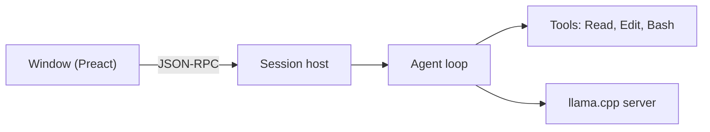
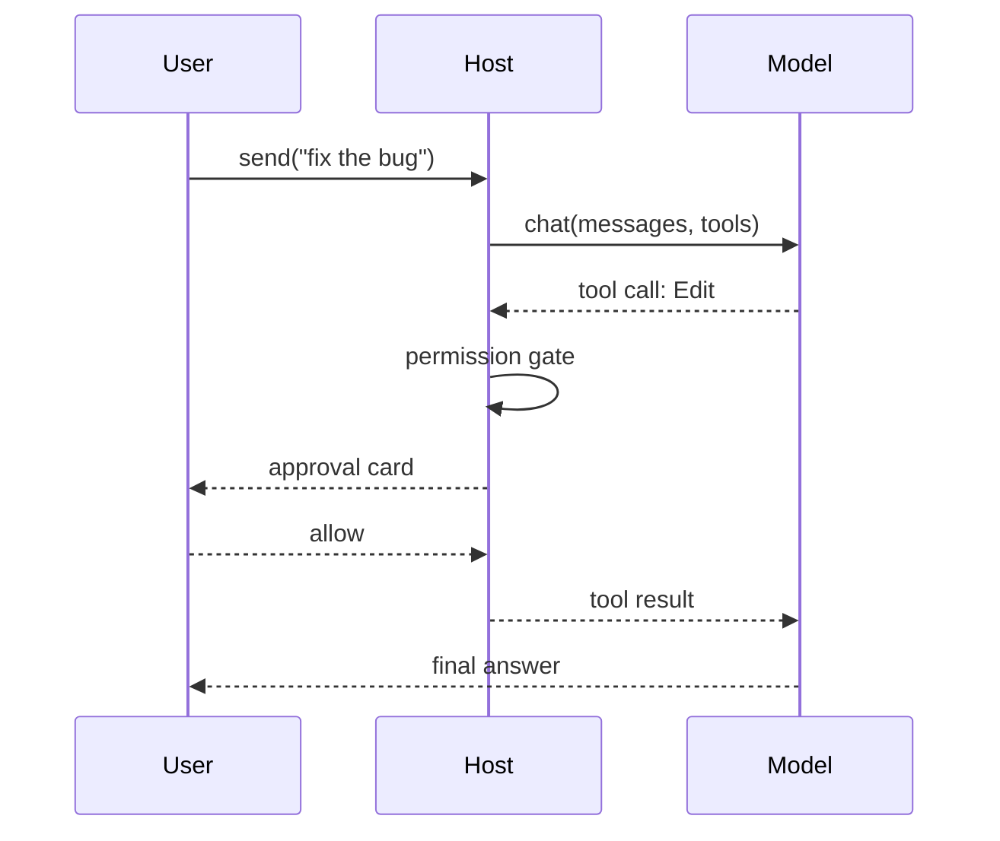
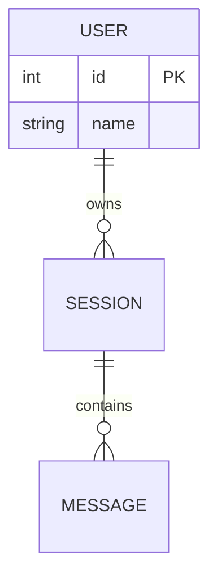

# Diagrams with Mermaid

A ```mermaid code block in your reply is rendered as a diagram in the window. A diagram
that fails to parse shows its source and the error instead, so the syntax rules below are
what make the difference.

## Pick the type

| question | diagram | opens with |
|---|---|---|
| how does X flow / what calls what | flowchart | `flowchart LR` (or `TD` for tall trees) |
| who talks to whom, in what order | sequence | `sequenceDiagram` |
| how are the types related | class | `classDiagram` |
| what is in the database | ER | `erDiagram` |
| which states, which transitions | state | `stateDiagram-v2` |
| when does what happen | Gantt | `gantt` |
| a topic and its parts | mind map | `mindmap` |

## Get the facts from the code first

- Entry points: `Read` the main file, the router, the CLI dispatcher.
- Edges: `Grep` for imports, `require(`, `import`, class names, event names, table names.
- Draw what the code does, not what its comments say it does. Name nodes after real
  files, functions, tables or services; one node per real thing.
- Thirty nodes is the ceiling for one diagram. Past that, draw the overview and one
  diagram per subsystem.

## Syntax that renders

- Node ids are letters and digits only (`api`, `db1`). Put the visible text in the label:
  `api["API server (Node)"]`. Quote every label that has spaces, parentheses, colons,
  commas or slashes.
- Line breaks inside a label: `<br/>`.
- Edges: `a --> b`, `a -- "label" --> b`, `a -.-> b` (dotted), `a ==> b` (thick).
- Subgraphs need a quoted title: `subgraph svc ["Services"] … end`.
- Sequence: declare `participant A as "Long name"` first; messages `A->>B: text`,
  replies `B-->>A: text`; `activate A` / `deactivate A`; `alt … else … end` for branches;
  `Note over A,B: text`.
- ER: `USER ||--o{ ORDER : places`; attributes in a block: `USER { int id PK string name }`.
- Class: `class Foo { +name: string +run(): void }`, relations `Foo <|-- Bar`, `Foo --> Baz`.
- State: `[*] --> Idle`, `Idle --> Running : start`.
- No `;` at line ends, no tabs, no trailing spaces after `end`. Comments start with `%%`.
- Keep everything ASCII-safe except inside quoted labels.

## Examples







## Delivering it

1. Put the diagram in the reply as a ```mermaid block; say in one line what it shows.
2. When the person wants it kept, `Write` it into a Markdown file (a ```mermaid block in
   `docs/*.md` renders on GitHub too) or as a `.mmd` file.
3. A PNG or SVG file needs mermaid-cli: `npx -y @mermaid-js/mermaid-cli -i x.mmd -o x.svg`.
   It downloads a browser on first use, so ask before running it.
4. If the diagram failed to render in the window, read the error shown under it: it is
   almost always an unquoted label or a stray character in an id.
